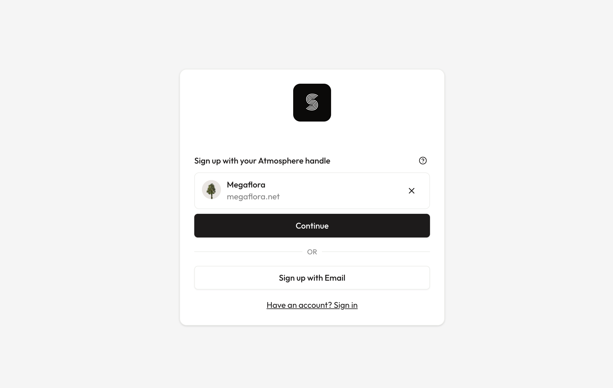
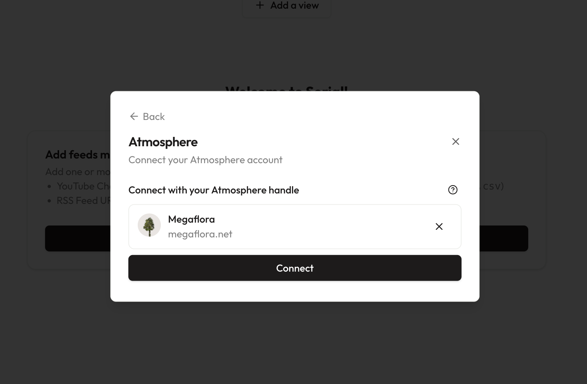
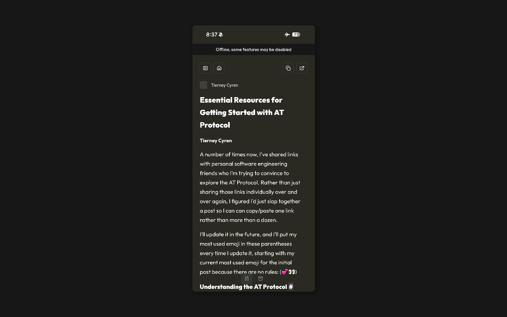

## Login with (or connect to) the Atmosphere

The “Atmosphere” refers to the family of apps and experiences built on the [AT Protocol](https://atproto.com/), a piece of technology designed by the people behind Bluesky to foster a more open and social web.

One of the first benefits you may notice with the Atmosphere is that it gives you the ability to login in to any site across the internet with your own domain (or Bluesky handle). This way, you don’t have to remember a password for each individual app you use, while still keeping full control over your sign in identity. It’s like “Sign in with Google”, but better: if Google decides to kick you off of their platform one day, you might lose access to the tens or hundreds of apps you use. If your login is through your own domain that you control, that isn’t a possibility.

As of today, users can now sign up to Serial with their Atmosphere account:

Also, existing users can link an Atmosphere account to their current account, allowing them to sign in with that Atmosphere account in the future:

There’s a lot more to appreciate about the Atmosphere that there’s not time to get into here. If you’re curious, take a look at [this blog post](https://bnb.im/posts/atproto-essential-resources/) for some introductory resources; they may be a bit technical, but the first suggested explainers from Dan Abramov should be approachable enough to anyone who feels at home on a computer.

As far a Serial is concerned, expect to see an integration with [Standard.Site](https://standard.site/) in the future, which has a lot of potential to be a more modernized and social version of RSS. The future of the social web is bright!

## Offline PWAs

PWAs (Progressive Web Apps) now load correctly when there is no service, and have a banner that shows offline status when relevant. This means you can now read your saved bookmarks, articles, and blogs while on the plane or between subway stops.

Content that isn’t downloaded will have a lower opacity than downloaded content, so it should be easy to tell what is available to read and what isn’t. If you run into any issues with this, don’t hesitate to [raise an issue](https://github.com/megaflorasoftware/serial/issues/new?template=bug-report.md)!

## Other Improvements

- Users no longer see a new release notification for newly-created accounts
- Users can still activate shortcuts while holding <kbd>Alt</kbd>
- Improved handling of large RSS feeds
- Improve OPML import robustness and general import logic

